# Automated Flow Screenshots

This document captures the automated screenshots generated by Maestro (Mobile) and Playwright (Web) during continuous integration and testing. **Per the agent.md guardrails, this file must be updated to include screenshots of *every new feature* developed.**

## Generating Screenshots

- **Web (Playwright):**
  1. Ensure the Expo web server is running: `npx expo start --web --port 8082`
  2. Run the screenshot script: `node take_web_screenshots.js`
- **Mobile (Maestro):** Run `maestro test .maestro/login_screenshot_flow.yaml` while an emulator is running.

---

## 1. Public / Guest Experience

| 1. Greetings Page | 2. Public Dashboard | 3. Events List |
| :---: | :---: | :---: |
| 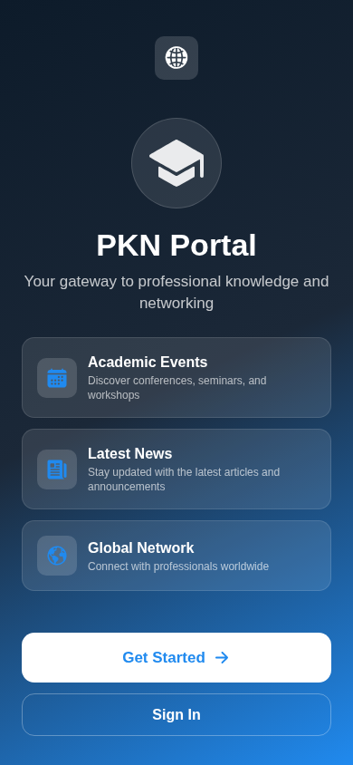 | 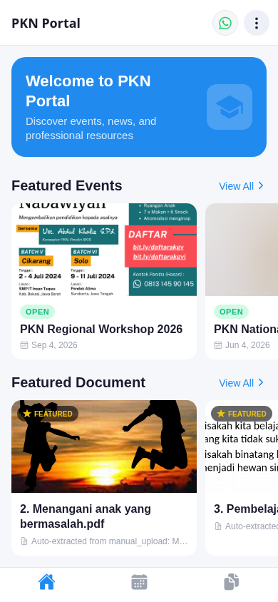 | 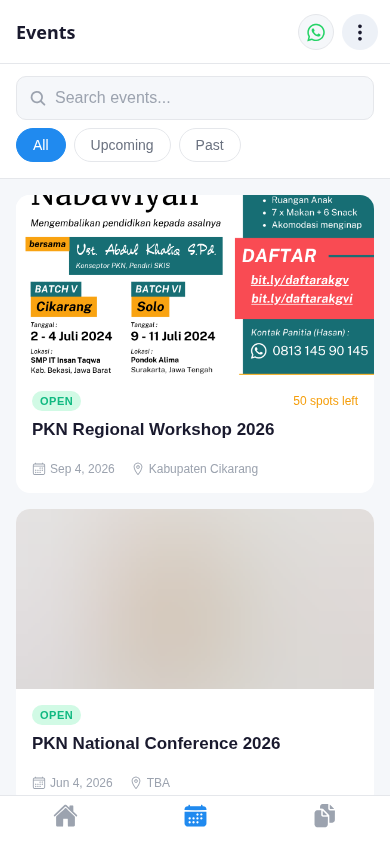 |

| 4. Event Detail | 5. News List | 6. News Detail |
| :---: | :---: | :---: |
| 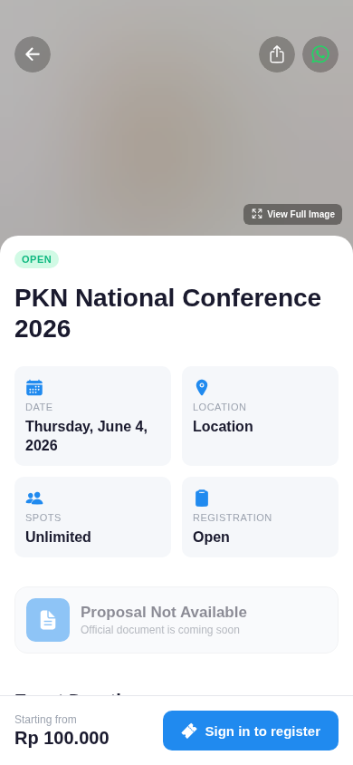 | 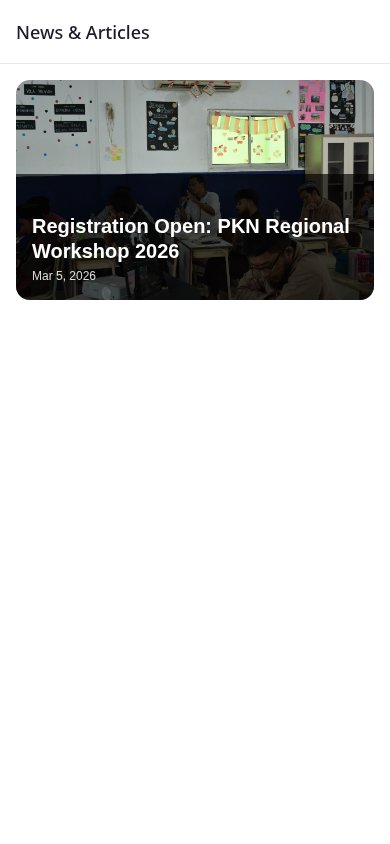 | 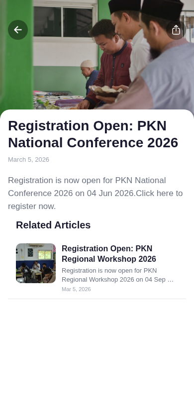 |

| 7. Documents List | 8. Registrations (Guest) | 9. Login Screen |
| :---: | :---: | :---: |
| 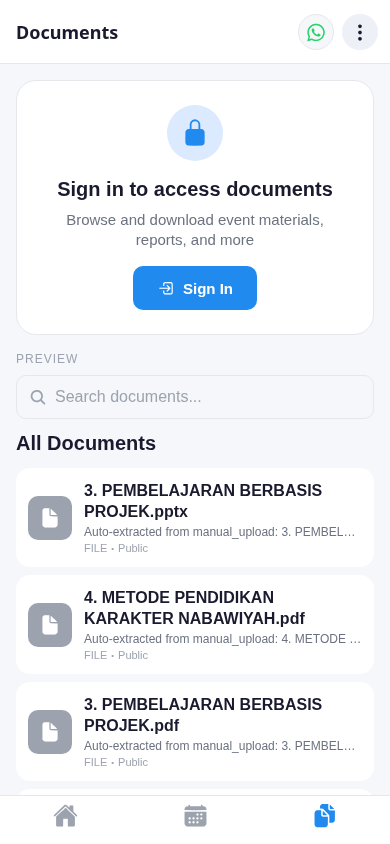 | 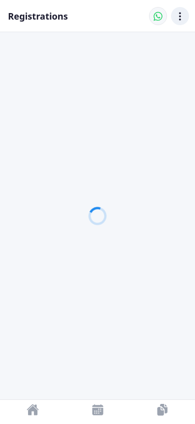 | 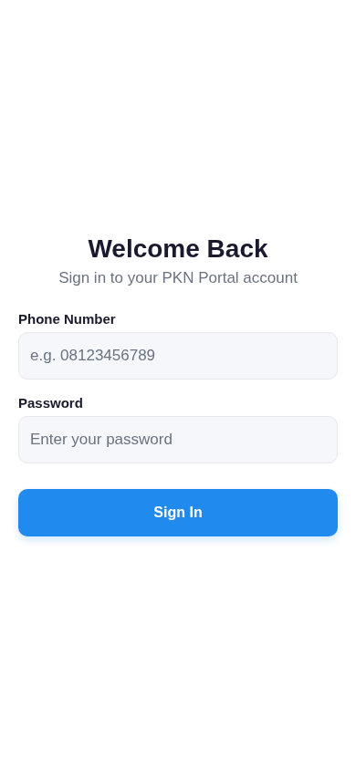 |

---

## 2. Authentication Flow

| 10. Phone Input | 11. Password Input | 12. Login Clicked |
| :---: | :---: | :---: |
|  | 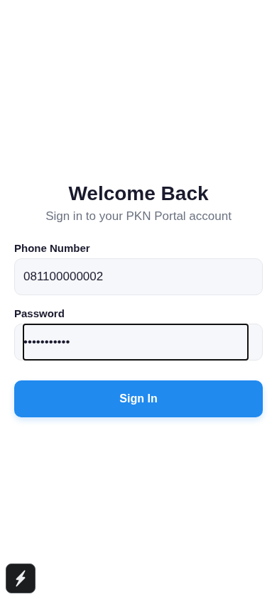 |  |

---

## 3. Authenticated Experience

| 13. Auth Dashboard | 14. Auth Registrations | 15. Profile Screen |
| :---: | :---: | :---: |
| 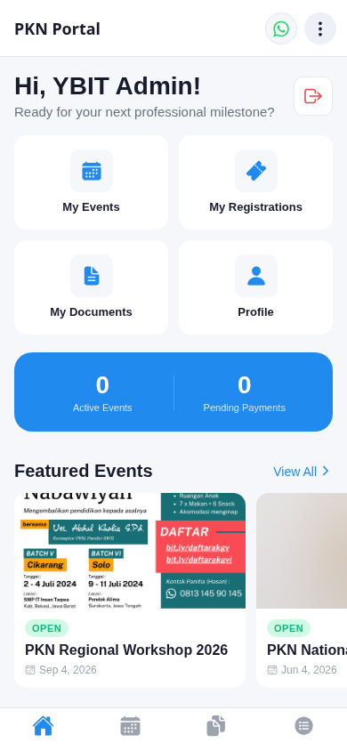 | 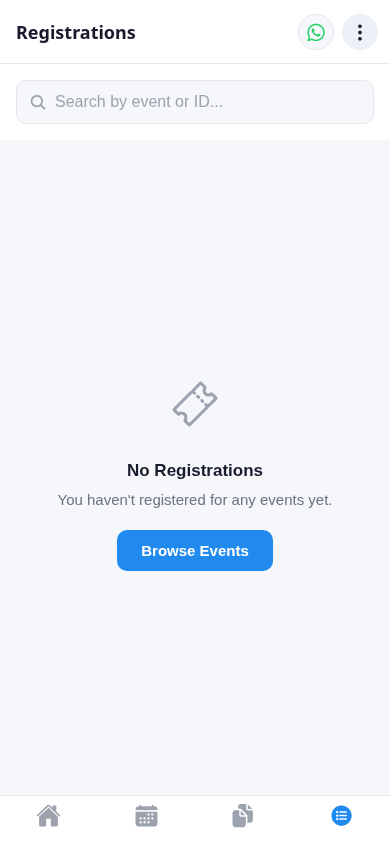 | 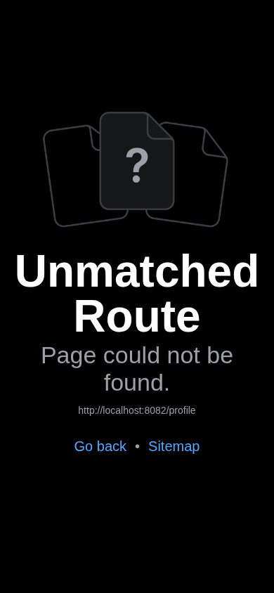 |

